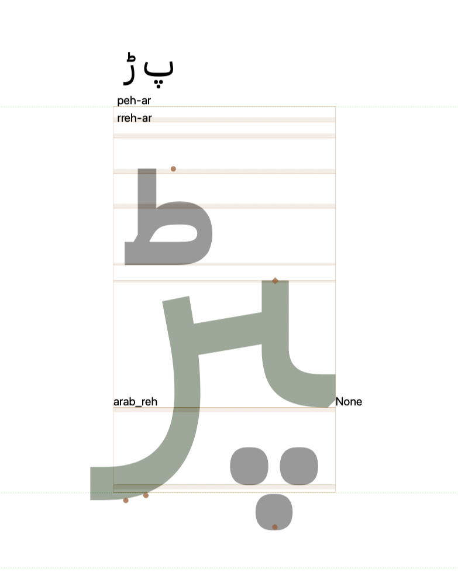

## Show Component names Plug-in

preview using IBM Plex Arabic

A simple plugin to show the basic component names of the selected glyph.

## License

License
Copyright 2023 [Fadhl Haqq](https://www.akufadhl.com) [@holdontype](https://www.holdontype.design)

Made possible with the [GlyphsSDK](https://github.com/schriftgestalt/GlyphsSDK) by Georg Seifert (@schriftgestalt), Jan Gerner (@yanone) and Rainer Erich Scheichelbauer (@mekkablue).

Licensed under the Apache License, Version 2.0 (the "License"); you may not use this file except in compliance with the License. You may obtain a copy of the License at

[http://www.apache.org/licenses/LICENSE-2.0](http://www.apache.org/licenses/LICENSE-2.0)

See the License file included in this repository for further details.